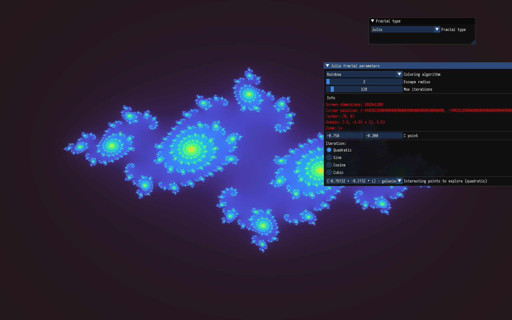
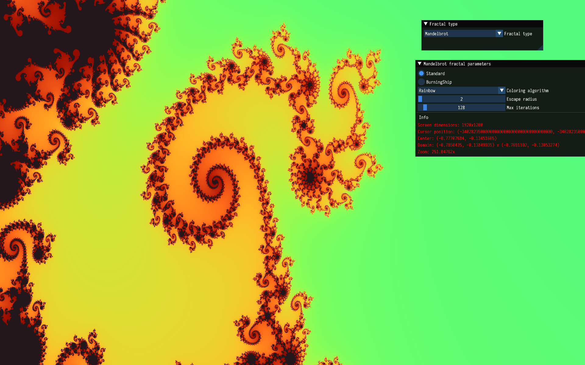
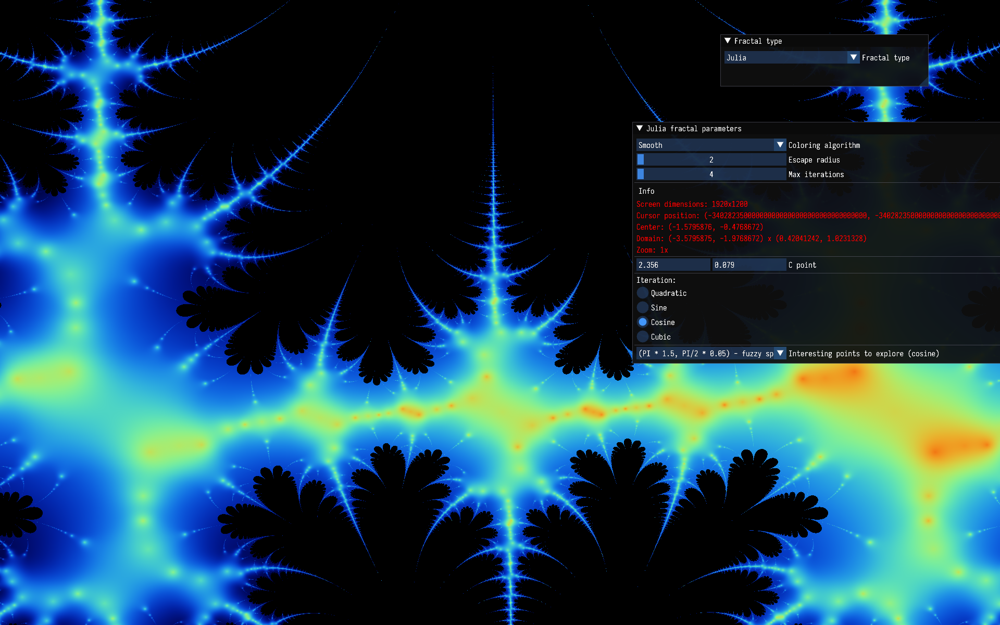
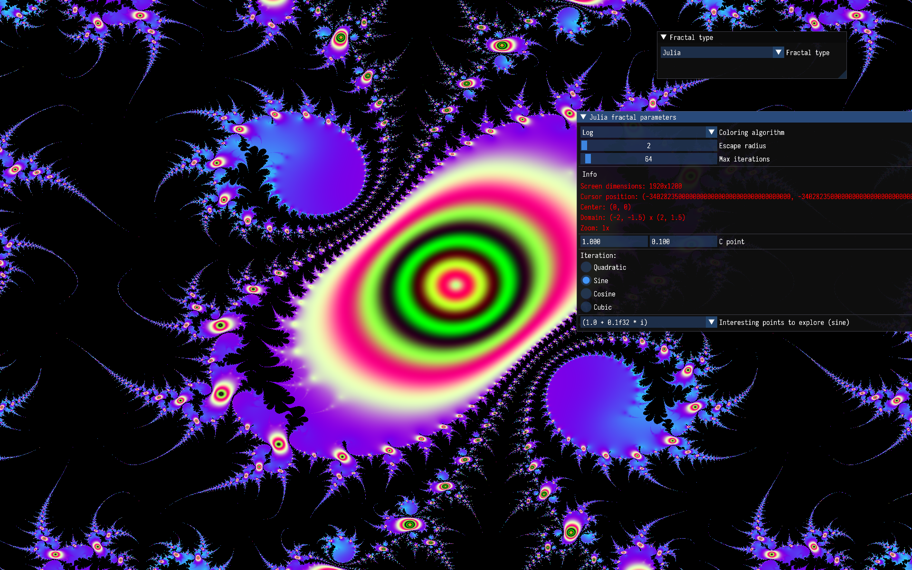

# README #

Exploring the Mandelbrot fractal using Rust and the Vulkan API.

### References ###

* [Mandelbrot Set](https://en.wikipedia.org/wiki/Mandelbrot_set)
* [Very interesting page with lots of cool things related to fractals](http://paulbourke.net/fractals/)
* [Vulkan API](https://www.vulkan.org/)
* [Coloring ideas](https://iquilezles.org/articles/palettes/)
* [Smooth iteration count](https://iquilezles.org/articles/msetsmooth/)

### How do I get set up? ###

``` sh
cargo run --release
```

### Navigation ###
- PageUp/PageDown - cycle coloring scheme
- Ins/Del - increase/decrease the escape radius
- NumPlus/NumMinus - increase/decrease the maximum iteration count
- Left click - center at pixel (if CTRL is pressed it will also zoom in)
- Right click - zoom out
- Mouse wheel - zoom in/out





